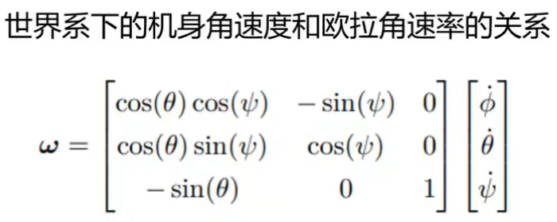
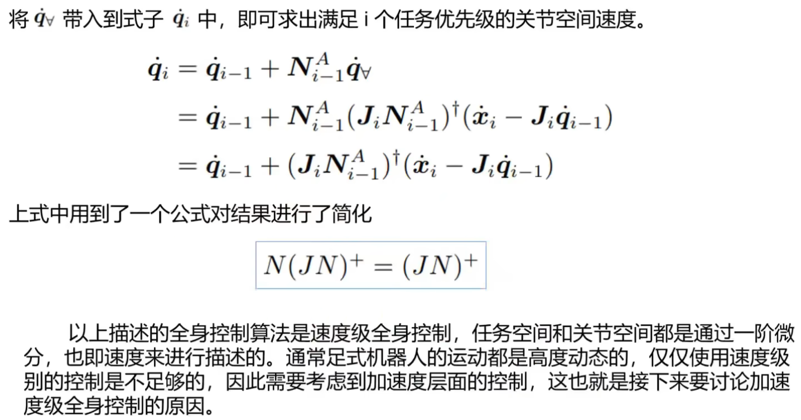

# 学习路线
- [Awesome-Embodied-AI-Robot](https://github.com/GlimmerLab/Awesome-Embodied-AI-Robot/tree/main)：本仓库收集了具身智能（Embodied AI）领域的研究资源，包括论文、代码实现、数据集等。具身智能研究机器人如何通过与环境交互来学习和完成任务，是人工智能和机器人技术的重要交叉领域
- [unitree_rl_gym](https://github.com/unitreerobotics/unitree_rl_gym)：这是一个基于 Unitree 机器人实现强化学习的示例仓库，支持 Unitree Go2、H1、H1_2和 G1
- [legged_gym](https://github.com/ZzzzzzS/legged_gym/tree/master)：来自瑞士联邦理工(ETH)的足式机器人团队利用NVIDIA的Isaac Gym仿真环境搭建了足式机器人深度强化学习的项目，[代码详解](https://www.bilibili.com/video/BV1sLx6eLEyt/?spm_id_from=333.1387.favlist.content.click&vd_source=cd40de797ad94ee69dcb9663bd87c89f)
- [humanoid-gym](https://github.com/roboterax/humanoid-gym)：基于Nvidia Isaac Gym的易于使用的强化学习框架,旨在训练人形机器人的运动技能,并强调从仿真到真实环境的零样本迁移。[视频](https://www.bilibili.com/video/BV19r421T7M8?spm_id_from=333.788.videopod.sections&vd_source=cd40de797ad94ee69dcb9663bd87c89f)，[视频](https://www.bilibili.com/video/BV1Y4421D7pn?spm_id_from=333.788.videopod.sections&vd_source=cd40de797ad94ee69dcb9663bd87c89f)

# [具身智能基础技术路线](https://www.bilibili.com/video/BV1d5ukedEsi/?spm_id_from=333.1387.favlist.content.click&vd_source=cd40de797ad94ee69dcb9663bd87c89f)
1. 数据引导：由于机器人的运动数据较少，所以采用一下方式来获取更有效的运动数据（更少的case）
   - 视频数据，模仿学习
   - 轻量化方案
     - UMI：机械手上加摄像头，采集夹取等动作的数据
     - DexCap：人带上两个手套和胸前的深度摄像头采集数据，手部数据由于人的形体和手的大小需要经过坐标变换来映射到机器人的3D空间
     - HIRO Hand：带上指套采集数据，数据不受手的尺寸影响
   - 多传感器方案：通过VR手套和VR眼镜来采集数据
   - 生成式仿真：
2. 动作执行
   1. Generative Imitation Learning：直接去学习每个joint的轨迹
      - ACT：输入的是视频流，然后encoder输出的是每个joint的状态，最后decoder输出动作
      - Diffusion Policy
      - 
   2. Affordance：
      - RoboAffordance：标注出一个接触点和接触后接触点的运动轨迹，像是一个任务
      - AffordPose：灵巧手的数据集，标注了对目标物体的每一个部分可以进行的动作，比如一个水壶，把手可以握持，盖子可以打开等等
      - SceneFun3D：类似AffordPose
      - 
   3. LLM QA
      - ManipLLM：给大模型一张物体，直接问他可以抓取哪里（接触点坐标），以及接下来接触点的运动方向
      - ManipVQA：类似
      - 
   
# [人形机器人控制基础](https://www.bilibili.com/video/BV1W1aUeJEF2/?spm_id_from=333.788.videopod.sections&vd_source=cd40de797ad94ee69dcb9663bd87c89f)
1. 控制方法：前两者仅适用于步态很慢的工况
   1. ZMP：零力矩点控制
   2. SLIP：把整个机器人抽象成一个弹簧倒立摆，通过控制弹簧的伸缩和速度来控制倒立摆
   3. MPC： 
2. 模型分类：
   1. 全身动力学（WBD）：
      1. 也叫浮动基座模型，可以分成驱动部分a和欠驱动部分u（躯体部分，公式中可以看到比驱动部分模型少了一个𝜏，因为没有关节可以对躯体进行直接控制）。
   2. 惯性中心动力学模型（CD）：
      1. 如果忽略驱动部分对全身的影响，可以得到中心动力学模型（Centroidal Dynamic），。形式上就是全身动力学的第一条公式。完整地考虑了线动量（pcom）和角动量（lcom）的变化，q表示躯体（b）和关节（j）的速度
   3. 单刚体动力学（SRBD）：
      1. 当肢体的质量相对于躯体很小的时候就可以忽略，从而把机器人简化成一个单刚体动力学模型（torso模型）。从形式上看就是去掉CD模型中的Aj和qj，即忽略关节的影响
   4. 倒立摆模型（LIPM）：
3. 构形分类
   分类：将人形机器人通过足部与地面的接触来划分为
   - 点足式  
      
   - 线足式，根据接触点的不同还有分类  
      
   - 面足式  
      
4. MPC建模（面足式单刚体动力学模型）：
   1. 动力学模型
    第三条公式要对旋转矩阵R（A空间变换到B空间）求导，有更简单的方法， 旋转矩阵可以被看作是B空间的基向量在A空间中的表示（三列r向量拼起来就是R矩阵），所以对旋转矩阵R求导就等于对基向量求导，对向量求导又等于角速度乘上向量长度（单位旋转向量对时间求导就等于角速度）三个符号分别是roll，pitch和yaw，是相对于机身的三个角速度。w是相对于世界的绝对角速度。举个例子，机器人在弯腰的过程中躯体发生旋转（yaw），这时垂直方向（z轴）上的角速度就不等于前面的yaw，会受到弯腰动作（pitch）的影响
   2. 系统动力学方程四个状态量分别是欧拉角，质心位置，角速度和质心速度前向欧拉离散化
   3. 约束：
   4. 求解器：qpOASES和OSQP  
   代码里是这种形式
   5. 转化成标准形式
   6. 工具：casdi（看起来很好用）：一种符号框架，可以直接定义符号，调用不同的求解器来求解，也可以用来求解雅可比矩阵，海森矩阵 之类的东西
5. 关节力矩求解：上面的求解结果是足端的力和力矩，但是实际上控制的是关节的力矩，所以还需要求力矩。
   1. 静力学（运动幅度小场景）：依据虚功原理，即足端力的微小位移做的功等于关节微小位移做的功，可以得到足端力到关节力矩（实际控制量）的关系，用雅科比矩阵表示
   2. 多刚体动力学（动态场景）
      1. 固定基座模型（机械臂）：
      2. 浮动基座模型（机器人）： 
      
      其中有三个不同点 
      - 没有用q，而是用u，并且q_dot=u，u比固定基座模型中的q多了body的线速度和角速度  
      - S是选择矩阵，满足下面的公式，𝜏 还是实际关节的驱动力据。所以当S_T乘上 𝜏，能得到和u相同维度的力矩向量，但是前6项是0,不产生实际影响 ，就像是给机器人加了一个虚拟关节，但是虚拟关节不产生实际力矩
      - 存在外力，前面讲到虚拟关节是驱动body的，不过虚拟关节不产生实际作用，但是body却存在加速度，那就u要外力来提供，实际上就是足端力（重力和扰动）
   3. 对于固定基座模型，可以通过关节力矩来求关节加速度（正动力学），，也可以知道关节加速度来求关节力矩（逆动力学）。但是对于浮动基座模型，知道关节加速度是求不出关节力矩的，还需要body的加速度
   4. reference：推导很复杂，可以用RBDL库来实现。教材推荐：Rigid Body Dynamic Algorithms
6. 全身控制方法
   1. 任务优先级
      本质上是机器人控制有多任务
      x表示任务空间，q表示关节空间，如果关节空间维度大于任务空间，就可以进行多任务  
   2. 零空间矩阵
      J是动力学模型的雅可比矩阵，**十字符号表示伪逆**  
      
   3. 基本原理
      首先要求出优先级最高的任务x_1对应的q_1，然后依次迭代，求出qi。其实q_i相比与q_i-1，就差了N×q_any(q向量中每一项的增量)，由于零空间矩阵的存在，q_i在满足x_i的同时也满足前i-1项任务。同一时刻q和每一项任务之间都有着对应的雅可比矩阵，如下
   4. 迭代过程（速度级控制）
      
   5. 加速度级控制   
      
   6. 伪代码
      

7. 松弛优化：加速度是由WBC求出来的，符合当下的控制，而足端力fc是由模型预测控制求出来的，更符合未来的控制，两者带入到模型会不相等，需要进行松弛优化。求解得到delta_f和delta_q，作为足端力和关节力矩的微小变量来使得原公式的左右两边误差最小

1.  sim2real
2.  传统控制缺点

# [双足行走的强化学习算法介绍与部署](https://www.bilibili.com/video/BV1Kq4PeEE1H/?spm_id_from=333.1387.favlist.content.click&vd_source=cd40de797ad94ee69dcb9663bd87c89f)
其中30分之后，会提到一些实际工作的问题，可以后期看看

